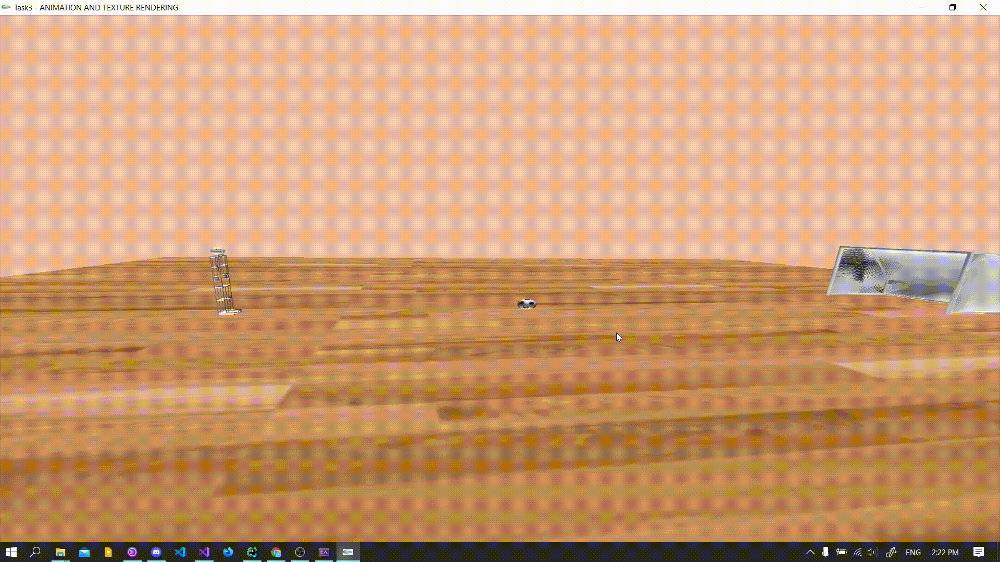
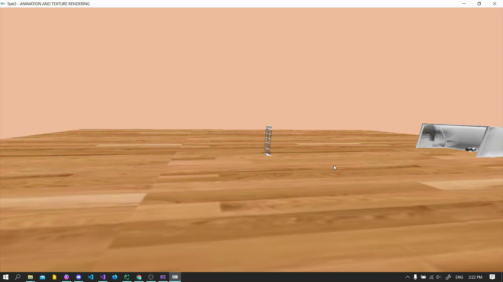

# TASK 3
***

### ANIMATION AND TEXTURE RENDERING
***
#### Brief Explanation

This file contains the code to create a robot prototype using Glut OpenGL.
The implementation steps went on with the following sequence:
1. Creating the robot prototype.
2. Setting a scene to hold the interaction/animation.
3. Adding objects, i.e. chair, ball, ...etc.
4. Adding lighting to the current scene.
5. Implementing animation methods.

***
#### Photo-Documentation
  
These photos show the functionality of the movement of the robot prototype.

**_Interaction Animation_**


**_Texture Mapping Menu_**


***
#### Code Snippets -pseudo code logic

Creating the robot:
```cpp
void display():
    glPushMatrix();                         // main body
        glPushMatrix();                     // head
        glPopMatrix();        
        glPushMatrix();                     // upper arm
            glPushMatrix();                 // arm
                glPushMatrix();             // hand
                glPopMatrix();
            glPopMatrix();
        glPopMatrix();        
    glPopMatrix();
```

Setting the scene:
_Setting the floor/room along with the texture rendering._

```cpp
void display():
    glEnable(GL_TEXTURE_2D);                // enable texture mapping
    glGenTextures(1, &_textureId)           // make texture using an image
    glBindTexture(GL_TEXTURE_2D, _textureId);
    glTexImage2D();                         // setting parameters
    glTexParameteri(GL_TEXTURE_2D, GL_TEXTURE_MIN_FILTER, GL_LINEAR);
    glTexParameteri(GL_TEXTURE_2D, GL_TEXTURE_MAG_FILTER, GL_LINEAR);
    glTexCoord2f();                         // adjusting texture coordinates

    glBegin(GL_QUADS);                      // setting the floor
    glNormal3f(0.0, 1.0, 0.0);
    glTexCoord2f(0.0f, 0.0f); glVertex3f(-70, -6, 30);
    glTexCoord2f(3.0f, 0.0f); glVertex3f(70, -6, 30);
    glTexCoord2f(3.0f, 3.0f); glVertex3f(70, -6, -70);
    glTexCoord2f(0.0f, 3.0f); glVertex3f(-70, -6, -70);
    glEnd();
```

Texture menu:
_On right mouse click, a menu shows up allwowing the user to choose a texture._

```cpp
const char* textureName = "textureName1.obj";
void screen_menu(int value):
    switch (value):
        case '1':
            textureName = "textureName1.obj";
            break;
        case '2':
            textureName = "textureName2.obj";
            break;
    reset();
    glutPostRedisplay();

int main():
    glutCreateMenu(screen_menu);
    glutAddMenuEntry("Floor Texture 1", 1);
    glutAddMenuEntry("Floor Texture 2", 2);
    glutAttachMenu(GLUT_RIGHT_BUTTON);

```

Adding objects to the scene:
<!-- <pre></pre> -->

```cpp
void display():
    glPushMatrix();
        glTranslatef(xObject, yObject, zObject);
        glRotate();
        glScale();
        glColor3b();
        drawmodel((char*)modelName, pModel);
    glPopMatrix();
```

Adding lighting:
<!-- <pre></pre> -->

```cpp
GLfloat light_ambient[] = { 1.0, 0.0, 1.0, 1.0 },   //Setting White Light Source RGBA
light_diffuse[] = { 1.0, 0.0, 1.0, 1.0 },
light_specular[] = { 1.0, 0.0, 1.0, 1.0 },
light_position[] = { 0.0, 1.5, 4.0, 1.0 };

void set_light_props():
    glLightfv(GL_LIGHT1, GL_POSITION, light_position);
    glLightfv(GL_LIGHT1, GL_AMBIENT, light_ambient);
    glLightfv(GL_LIGHT1, GL_DIFFUSE, light_diffuse);
    glLightfv(GL_LIGHT1, GL_SPECULAR, light_specular);
    glEnable(GL_LIGHT1);
    glEnable(GL_LIGHTING);
```

Animation rendering:
<!-- <pre></pre> -->

```cpp
void setPoses(int frame):
    if (frame < 11)
        RightLegx = walkposes[frame][0];
        RightKneex = walkposes[frame][1];
        LeftLegx = walkposes[frame][2];
        LeftKneex = walkposes[frame][3];
        shoulderx = walkposes[frame][4];
        shoulderx2 = walkposes[frame][5];
        xBody += 2;

void timer(int value):
    Frame = Frame;
    setPoses(Frame);
    Frame++;
    if (Frame < 10) {
        glutPostRedisplay();
        glutTimerFunc(600, timer, 0);
    else if (Frame < 11)
        glutPostRedisplay();
        glutTimerFunc(600, timer, 0);
        glutTimerFunc(600, timer2, 0);
```

***
#### Issues Covered and Solved

1. After applying texture mapping methods to the floor, the robot disappears.
```txt
Translate robot above the floor.
```

2. Reset button "0" doesn't reset the scene, instead it makes everything disappear.
```txt
The button resets the camera back to the origin point.
```

***
#### Key-mapping Table

This table is used as a guide as to what to press according to the movement needed:

<!-- tr means table row -->
<!-- td means table data -->
<table>
<tr><td>
<!-- arm movement -->

| KEY | Movement |
| :--: | :--: |
| 'R' & 'r' | right shoulder X |
| 'E' & 'e' | left shoulder X |
| 'T' & 't' | right shoulder Z |
| 'W' & 'w' | left shoulder Z |
| 'D' & 'd' | right elbow X |
| 'S' & 's' | left elbow X |


</td><td>
<!-- leg movement -->

| KEY | Movement |
| :--: | :--: |
| 'O' & 'o' | right hip X |
| 'I' & 'i' | left hip X |
| 'P' & 'p' | right hip Z |
| 'U' & 'u' | left hip Z |
| 'L' & 'l' | right knee X |
| 'K' & 'k' | left knee X |

</td><td>
<!-- camera movement -->

| KEY | Movement |
| :--: | :--: |
| 'F' & 'f' | finger base |
| 'G' & 'g' | finger up |
| '0' | camera reset |
| '+' | zoom in |
| '-' | zoom out |
| 'm' | begin animation |
| 'right click' | choose texture |

</td></tr>
</table>

***  
#### Team Members:
  
  - 1 - 26 - Hussein Mohamed Saad AbdElHafez
  - 1 - 51 - AbdElRahman Muhsen AbdElLatif AbdElGhany
  - 2 - 27 - Mariam Magued Habib Bebawy
  - 2 - 51 - Youssef Ahmed MahmoudElSayed Shawky