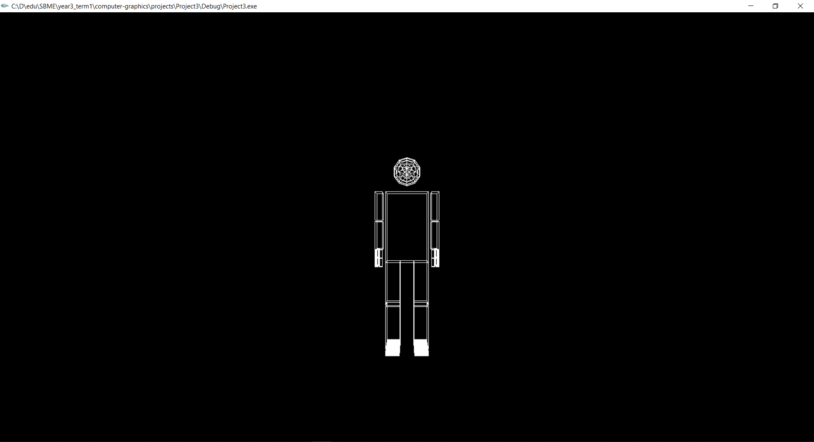
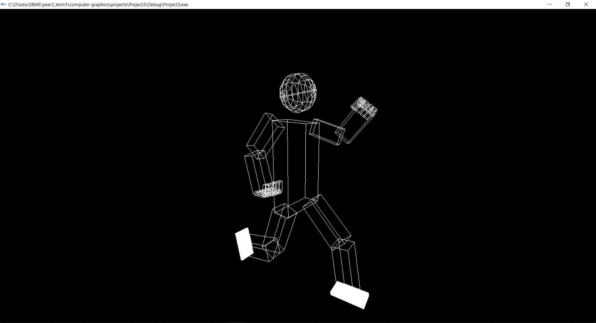
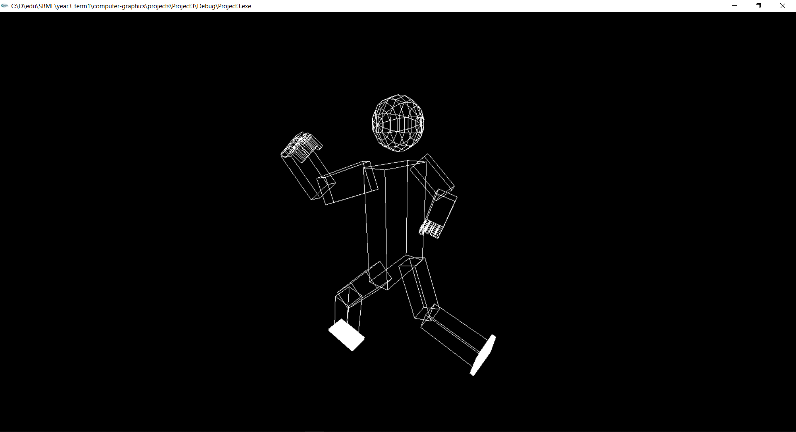
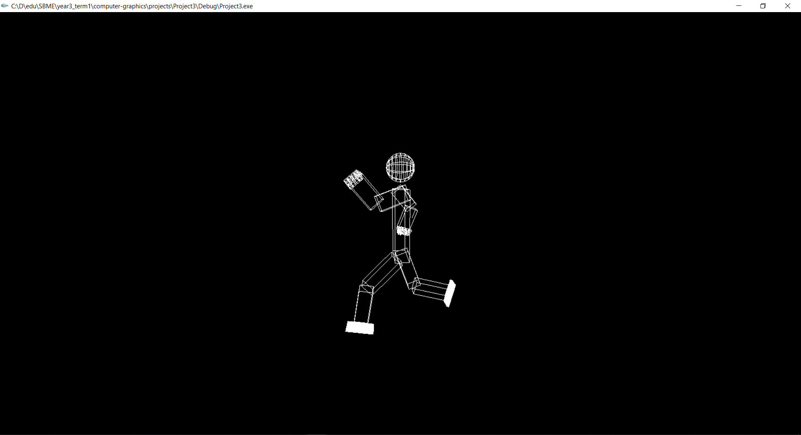

# TASK 2
***

### ROBOT PROTOTYPE
***
#### Brief Explanation

This file contains the code to create a robot prototype using Glut OpenGL.
The implementation steps went on with the following sequence:
1. Define the basic building blocks of the robot prototype; i.e: body,      head, upper arms, arms, upper legs, legs, and feet.
2. Create basics building blocks of the robot.
3. Add rotation to the building blocks of the robot.
4. Add camera perspective.

***
#### Photo-Documentation
  
These photos show the functionality of the movement of the robot prototype.





  
***
#### Code Snippets

Pseudo code logic for creating the robot:
<pre>This should be completed for the rest of the limbs.
The "hand" created consists of the fingers created in task-1. </pre>
```cpp
void display():
    glPushMatrix();                     // main body
        glPushMatrix();                 // head
        glPopMatrix();        
        glPushMatrix();                 // upper arm
            glPushMatrix();             // arm
                glPushMatrix();         // hand
                glPopMatrix();
            glPopMatrix();
        glPopMatrix();        
    glPopMatrix();
```

Pseudo code logic for adding the rotation in any glPushMatrix():
<pre>The full implementation of translation, rotation, scaling should be used.</pre>

```cpp
void display():
    glPushMatrix();
        glTranslatef(0, yTranslate, 0);
        glRotatef((GLfloat)zRotate, 0.0, 0.0, 1.0);
        glTranslatef(0, yTranslate, 0);
        glPushMatrix();
            glScalef(xScale, yScale, zScale);
            glutWireCube(1.0);
        glPopMatrix();
    glPopMatrix();

void keyboard():
    case('S'):                                      // keyboard key
        if(zRotate < 70 % 360)                      // movement constraint
            zRotate = (zRotate + 5) % 360;
        glutPostRedisplay();
        break;
```

Pseudo code logic for camera rotation:
<pre>This is to be used along with the implementation of the functions defined.</pre>

```cpp
void init():                                // initialize camera
    glMatrixMode(GL_PROJECTION);
    gluPerspective(60.0, 1.0, 1.0, 20.0);

global double eye[], double center[], double up[];
                                            // define camera eye variables
void crossProduct()                         // vector operations
void normalize()
void rotatePoint()
void reset()                                // reset camera
void rotateCameraRight()                    // right and left camera movement
void rotateCameraLeft()
void rotateCameraUp()                       // up and down camera movement
void rotateCameraDown()
void zoomIn()                               // forward and backward camera movement
void zoomOut()
```

***
#### Key-mapping Table

This table is used as a guide as to what to press according to the movement needed:

<!-- tr means table row -->
<!-- td means table data -->
<table>
<tr><td>
<!-- arm movement -->

| KEY | Movement |
| :--: | :--: |
| 'R' & 'r' | right shoulder X |
| 'E' & 'e' | left shoulder X |
| 'T' & 't' | right shoulder Z |
| 'W' & 'w' | left shoulder Z |
| 'D' & 'd' | right elbow X |
| 'S' & 's' | left elbow X |


</td><td>
<!-- leg movement -->

| KEY | Movement |
| :--: | :--: |
| 'O' & 'o' | right hip X |
| 'I' & 'i' | left hip X |
| 'P' & 'p' | right hip Z |
| 'U' & 'u' | left hip Z |
| 'L' & 'l' | right knee X |
| 'K' & 'k' | left knee X |

</td><td>
<!-- camera movement -->

| KEY | Movement |
| :--: | :--: |
| 'F' & 'f' | finger base |
| 'G' & 'g' | finger up |
| '0' | camera reset |
| '+' | zoom in |
| '-' | zoom out |

</td></tr>
</table>

***  
#### Team Members:
  
  - Hussein Mohamed Saad AbdElHafez - 1 - 26
  - AbdElRahman Muhsen AbdElLatif AbdElGhany - 1 - 51
  - Mariam Magued Habib Bebawy - 2 - 27
  - Youssef Ahmed MahmoudElSayed Shawky - 2 - 51