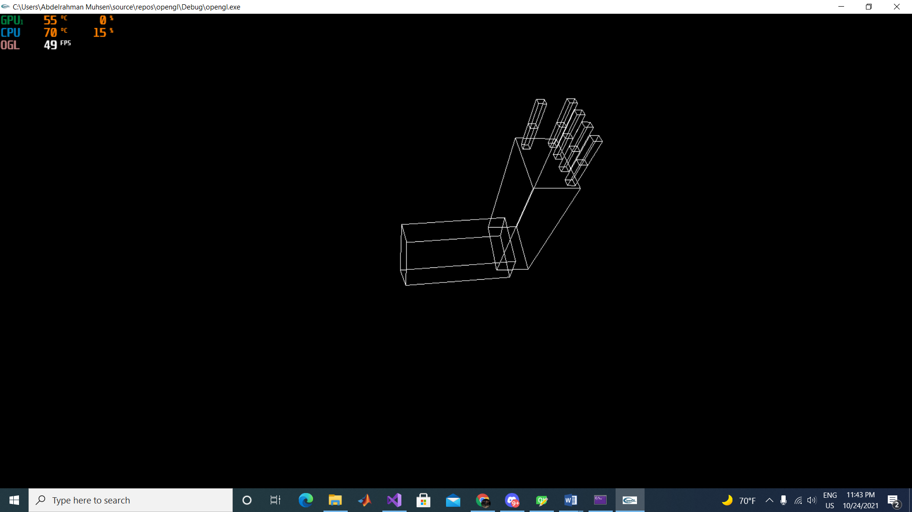
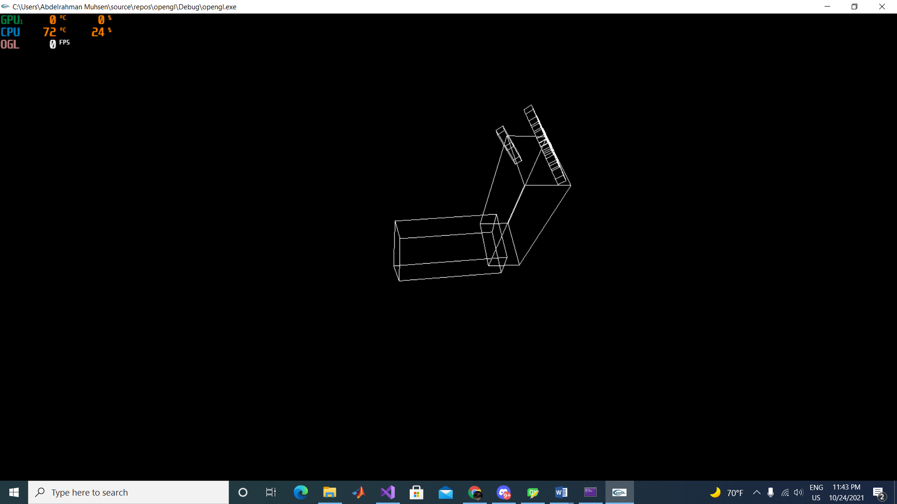
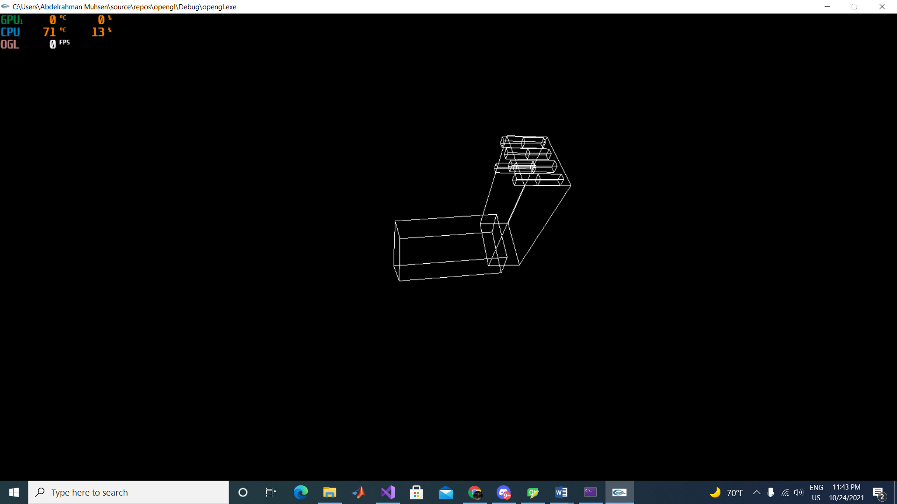
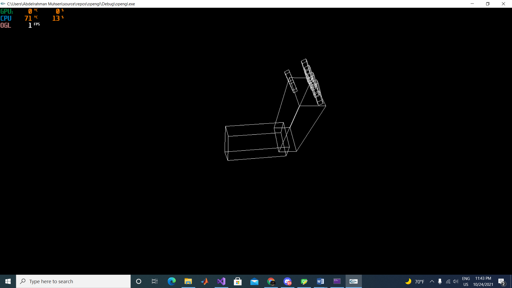

# TASK 1
***

### ROBOTIC ARM PROTOTYPE
***

The supplied file contained the starter code to use to make this task possible.  
  
The starter code contained three simple cuboids representing the arm, forearm, the finger base, and the finger tip.
  

We took the liberty of adding more to the code to add four more fingers and shift them around to make the prototype look more like an actual hand.
***
  
These photos show the arm and the fingers after moving them around.
  

***
  
We faced a few problems when defining the variables of the fingers and integrating those definitions with the movement keybinds.
We were able to partially solve these problems by looking through the documentations of OpenGL.
***
  
#### Team Members:
  
  - Hussein Mohamed Saad AbdElHafez - 1 - 26
  - AbdElRahman Muhsen AbdElLatif AbdElGhany - 1 - 51
  - Mariam Magued Habib Bebawy - 2 - 27
  - Youssef Ahmed MahmoudElSayed Shawky - 2 - 51